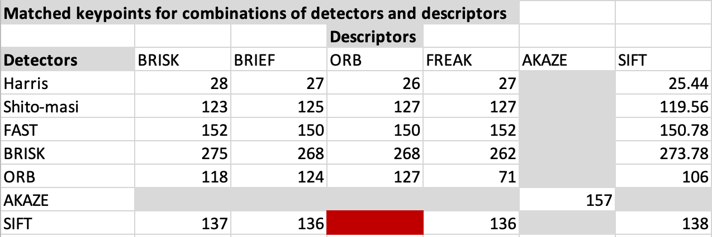
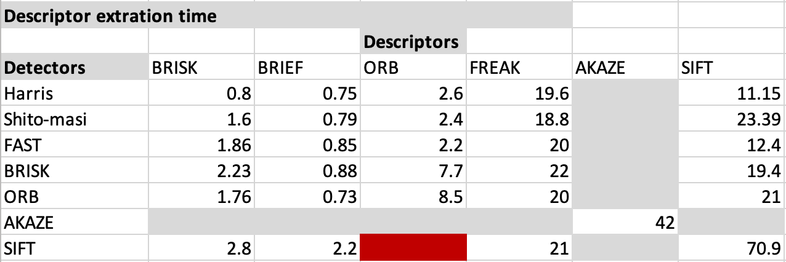

# 2D Feature Tracking

In preparation for building a collision detection system, this project tests various keypoint detector and descriptor combinations to see which one performs the best. Implemented in OpenCV the following keypoint deetectors were tested:  
* **Gradient-based detectors** -> Shi-Tomasi, Harris, SIFT
* **Binary detectors** -> FAST, BRISK, ORB, AKAZE, BRIEF

Along with the following descriptor extractors:
* **Gradient-based descriptors** -> SIFT
* **Binary descriptors** -> BRISK, ORB, AKAZE, BRIEF, FREAK

## Rubric Items Addressed 
_MP.1 Data Buffer Optimization_ - This is done by implenting a standard queue. Line 72 in MidTermProject_Camera_Student.cpp 

_MP.2 Keypoint Detection_ - Modern and classic detectors are implemented in matching2D_Student.cpp starting on line 116.  

_MP.3 Keypoint Removal_ - Keypoints are removed outside a pre-defined recatangle on line 104 in MidTermProject_Camera_Student.cpp  

_MP.4 Keypoint Descriptors_ - Keypoint descriptors are implemented in matching2D_Student.cpp starting on line 67.  

_MP.5 Descriptor Matching_ - FLANN and kNN selection methods implemented in matching2D_Student.cpp starting on line 7.  

_MP.6 Descriptor Distance Ratio_ - Filter keypoints implemented in matching2D_Student.cpp starting on line 50.  

_MP.7 Keypoint Frame Count Evaluation_ - The FAST algorithm is clearly _faster_ than the other methods and yields a surpising amount of keypoints when filtered on the preceeding vehicle. BRISK detects more keypoints but at a cost.

_MP.8 Matched Keypoint Evaluation_ - When matching keypoints it seems that there is no dependancy on the descriptor type. It is purly based on the amount of keypoints the detector algorithm finds. It makes sense because in general, the more keypoints identified, the more matches you will have. The only one that stands out is using ORB with FREAK. It doesn't seem to match well.

_MP.9 Descriptor Extraction Evaluation_ - Based on the data the Top3 combinations of detectors/descriptors are:
1. BRISK detector and BRIEF descriptor - This combination seems to be a good mix of speed and matching. However, it does take longer to identify keypoints.
2. FAST detector and BRIEF descriptor - This is almost a tie with first. This detector does not identify as many keypoints, however in doing so, it is orders of magnitude faster. 
3. ORB detector and BRIEF deescriptor - This comination is a good mix of speed and keypoint count.

It is difficult to make a decision based on this data though. Accuracy and precision seem likely to influence results. It is also difficult to determine what combination is better. Is speed valued over amount of keypoints found? Questions I hope to answer in the coming projects.
## Dependencies for Running Locally
The following dependencies are required to run the program locally.
* cmake >= 3.17
  * All OSes: [click here for installation instructions](https://cmake.org/install/)
* make >= 4.3 (Linux, Mac)
  * Linux: make is installed by default on most Linux distros
  * Mac: [install Xcode command line tools to get make](https://developer.apple.com/xcode/features/)
* OpenCV >= 4.5
  * The OpenCV 4.5 source code can be found [here](https://github.com/opencv/opencv/tree/4.1.0)
* gcc/g++ >= 5.4
  * Linux: gcc / g++ is installed by default on most Linux distros
  * Mac: same deal as make - [install Xcode command line tools](https://developer.apple.com/xcode/features/)
* NOTE: This project is tested using Mac OSX 10.15

## Basic Build Instructions

1. Clone this repo.
2. Make a build directory in the top level directory: `mkdir build && cd build`
3. Compile: `cmake .. && make`
4. Run it: `./2D_feature_tracking`.